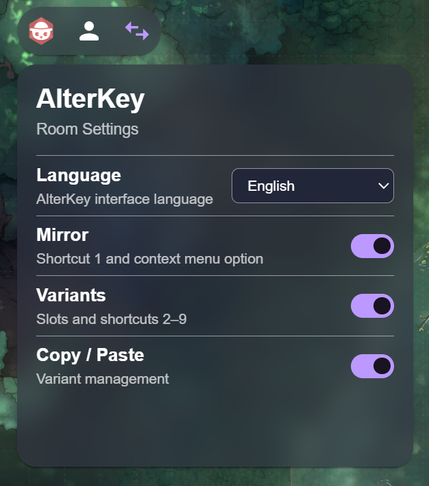
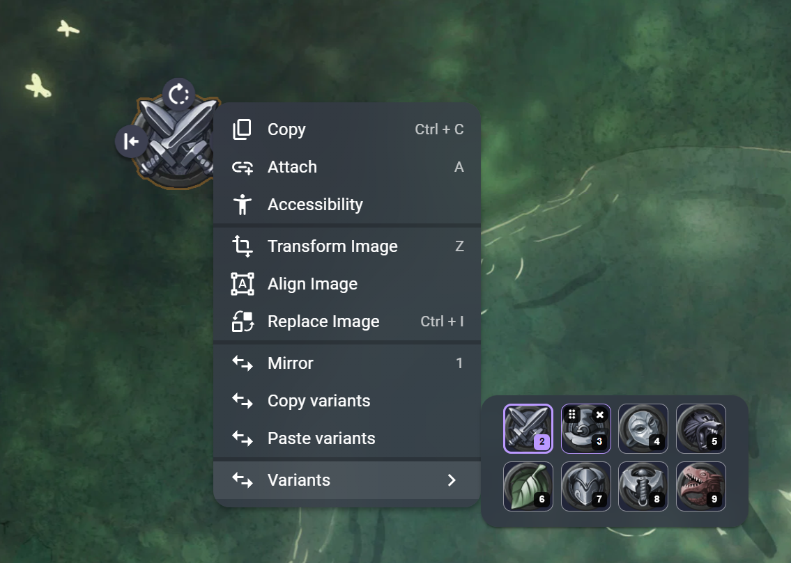
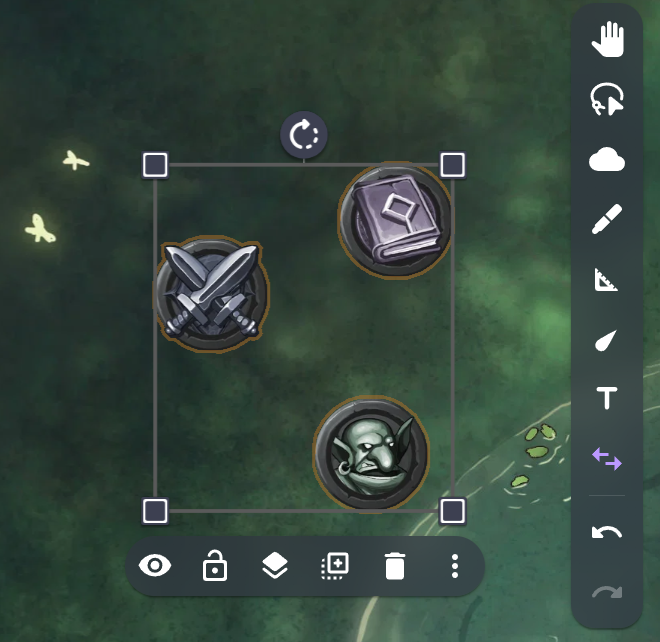

# AlterKey

*Token shortcuts, variants, and quick actions.*

AlterKey is an Owlbear Rodeo extension for faster and more flexible token control. It adds keyboard shortcuts, reusable token variants, mirroring, multi-selection, and room-level controls without interrupting the flow of play.

<p align="center">
  
</p>

## Features

- 🪞 **Mirror tokens** with shortcut `1` or from the context menu.
- 🔢 **Switch token variants** with shortcuts `2–9`.
- ⇧ **Select multiple tokens** with `Shift + Click` while AlterKey is active.
- 📋 **Copy and paste variant sets** between tokens while preserving each token's base image.
- ⚙️ **Enable or disable features per room** from the AlterKey settings panel.
- 🌐 **English and Portuguese (Brazil)** interface support.
- 🌗 **Light and dark theme** integration.

## How to use

### Activate AlterKey

Press `V` to activate the AlterKey tool.

While the tool is active, the shortcuts below can be used directly on selected image tokens.

| Shortcut | Action |
| --- | --- |
| `V` | Activate AlterKey |
| `1` | Mirror selected token(s) |
| `2–9` | Switch to the matching variant slot |
| `Shift + Click` | Add or remove a token from the current selection |

### Mirror tokens

Select one or more image tokens and press `1` to mirror them horizontally.

Mirror is also available from the token context menu when the feature is enabled.

### Token variants

Each configured token can use up to eight image slots mapped to shortcuts `2–9`.

- **Slot `2`** is the token's fixed base image.
- **Slots `3–9`** are extra variants.
- Pressing a number switches the selected token to that slot.
- The active variant is highlighted in the Variants panel.

<p align="center">
  
</p>

### Manage variants

GMs can manage variants from the Variants panel:

- add images from the Owlbear asset library;
- remove extra variants that are not currently active;
- reorder slots `3–9`;
- keep slot `2` protected as the token's base image.

Players can switch variants, but variant management controls are GM-only.

### Select multiple tokens

While AlterKey is active, hold `Shift` and click tokens to add or remove them from the current selection.

Shortcuts such as `1` and `2–9` can then be applied to the selected tokens together.

<p align="center">
  
</p>

### Copy and paste variants

GMs can copy the extra variants from one token and paste them onto another token or multiple tokens at once.

Copy / Paste only transfers slots `3–9`. Each destination token keeps its own slot `2` base image.

If a destination token is displaying an old variant that no longer exists after paste, AlterKey returns it to its base image.

### Room settings

The AlterKey settings panel allows the GM to enable or disable:

- Mirror;
- Variants;
- Copy / Paste.

Disabled context-menu options disappear immediately. If a disabled feature is triggered from the keyboard, AlterKey shows a notification explaining that the feature is disabled.

The interface language can also be changed between:

- English;
- Português (Brasil).

English is the default language.

## Permissions

Players can use Mirror and switch variants when Owlbear Rodeo grants them update permission for the selected token.

Variant management, reordering, Copy / Paste, and room settings changes are GM-only operations.

## Installation

AlterKey is currently in development.

For local testing, add the development manifest to Owlbear Rodeo:

```text
http://localhost:5173/manifest.json
```

Public installation instructions will be added once the extension is hosted.

## Development

AlterKey uses the Owlbear Rodeo SDK and Vite 8.

### Requirements

- Node.js 20.19+ or 22.12+
- npm

### Run locally

```bash
npm install
npm run dev
```

### Project checks

```bash
npm run verify
```

### Production build

```bash
npm run build
```

The production output is generated in `dist/`.

For architecture details, see [`docs/ARCHITECTURE.md`](docs/ARCHITECTURE.md).

For the release checklist, see [`docs/TESTING.md`](docs/TESTING.md).

## Author

Created by **Linkpaladino**.

## License

AlterKey is released under the MIT License. See [`LICENSE`](LICENSE).
