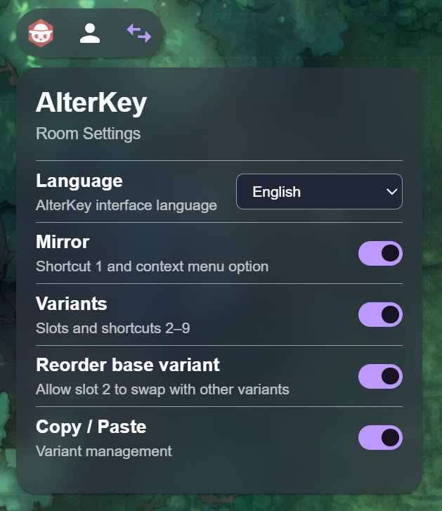
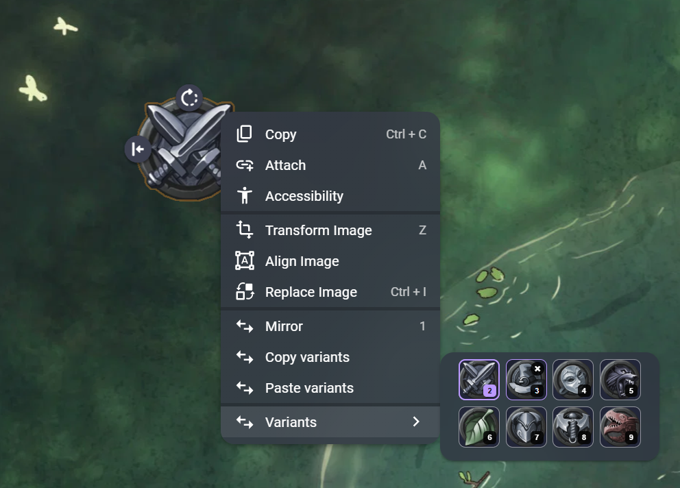
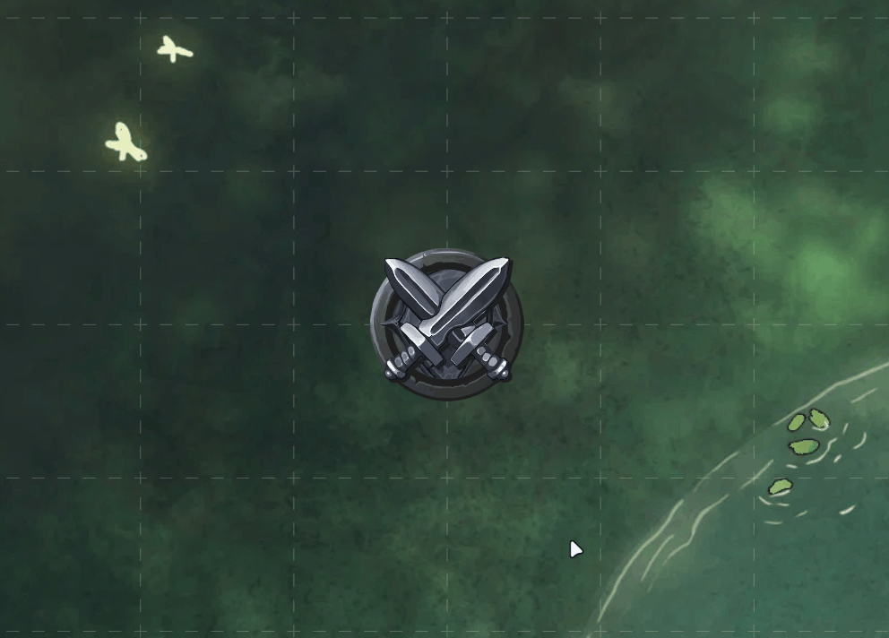
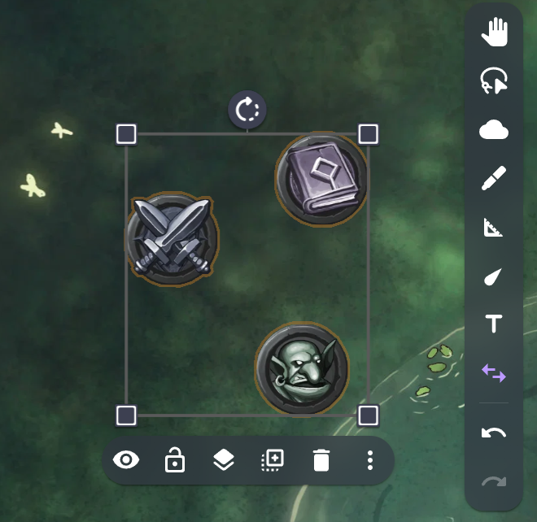

# AlterKey

*Token shortcuts, variants, and quick actions.*

AlterKey is an Owlbear Rodeo extension for faster and more flexible token control. It adds keyboard shortcuts, reusable token variants, mirroring, multi-selection, per-variant scaling, and room-level controls without interrupting the flow of play.

## Features

- **Mirror tokens** with shortcut `1` or from the context menu.
- **Switch token variants** with shortcuts `2–9`.
- **Keep an individual scale for each variant**, allowing images with different dimensions to maintain the intended visual size.
- **Synchronize native `Replace Image` changes** with the currently active variant.
- **Select multiple tokens** with `Shift + Click` while AlterKey is active.
- **Copy and paste variant sets** between tokens while preserving each token's current base image.
- **Optionally reorder the base variant** in slot `2`.
- **Enable or disable features per room** from the AlterKey settings panel.
- **English and Portuguese (Brazil)** interface support.
- **Light and dark theme** integration.

## Room settings

The AlterKey settings panel lets the GM control which features are available in the room and change the interface language.



The GM can enable or disable:

- Mirror;
- Variants;
- Copy / Paste;
- Base variant reordering.

Base variant reordering is disabled by default. When enabled, another variant can be swapped into slot `2` and becomes the token's new base variant.

Disabled context-menu options disappear immediately. If a disabled feature is triggered from the keyboard, AlterKey shows a notification explaining that the feature is disabled.

The interface language can be changed between:

- English;
- Português (Brasil).

English is the default language.

## How to use

### Activate AlterKey

Press `V` to activate the AlterKey tool.

While the tool is active, the shortcuts below can be used directly on selected image tokens.

| Shortcut | Action |
| --- | --- |
| `V` | Activate AlterKey |
| `1` | Mirror selected token(s) |
| `2–9` | Switch to the matching variant slot |
| `Shift + Click` | Add or remove a token from the current selection |

### Mirror tokens

Select one or more image tokens and press `1` to mirror them horizontally.

Mirror is also available from the token context menu when the feature is enabled.

### Token variants

Each configured token can use up to eight image slots mapped to shortcuts `2–9`.

- **Slot `2`** is the current base variant and is protected by default.
- **Slots `3–9`** are additional variants.
- Pressing a number switches the selected token to that slot.
- The active variant is highlighted in the Variants panel.
- Each variant can keep its own image and scale.

The Variants panel provides quick access to every configured token image and shows which variant is currently active.



### Manage variants

GMs can manage variants from the Variants panel:

- add images from the Owlbear asset library;
- remove extra variants that are not currently active;
- reorder variants by dragging anywhere on the variant card;
- keep slot `2` protected as the base variant by default;
- optionally allow another variant to be swapped into slot `2`.

When base variant reordering is enabled, moving another variant into slot `2` makes it the new base. The previous base moves to the other variant's slot and becomes a regular removable variant.

Players can switch variants, but variant management controls are GM-only.

### Variant scale and image sync

Each variant stores its own scale. This allows images with very different dimensions or resolutions to maintain the intended visual size when switching between variants.

A newly added variant initially inherits the scale of the base variant. If that variant is resized manually in Owlbear Rodeo, AlterKey stores the new scale for that variant only.



Using Owlbear Rodeo's native `Replace Image` action also updates the currently active variant. This keeps AlterKey synchronized with image changes made directly to the token.

Mirroring remains independent from variant scale, so switching variants preserves the token's current mirrored or non-mirrored orientation.

### Select multiple tokens

While AlterKey is active, hold `Shift` and click tokens to add or remove them from the current selection.

Shortcuts such as `1` and `2–9` can then be applied to the selected tokens together.



### Copy and paste variants

GMs can copy the extra variants from one token and paste them onto another token or multiple tokens at once.

Copy / Paste only transfers slots `3–9`. Each destination token keeps whatever variant is currently assigned to its own slot `2`.

If a destination token is displaying an old variant that no longer exists after paste, AlterKey returns it to its base image.

## Permissions

Players can use Mirror and switch variants when Owlbear Rodeo grants them update permission for the selected token.

Variant management, reordering, Copy / Paste, and room settings changes are GM-only operations.

## Installation

AlterKey is currently hosted publicly on Vercel and can be installed in Owlbear Rodeo using the manifest URL below:

```text
https://alter-key.vercel.app/manifest.json
```

Add this manifest URL to Owlbear Rodeo to install AlterKey in your account.

AlterKey is not yet listed in the official Owlbear Rodeo Extension Store.

## Development

AlterKey uses the Owlbear Rodeo SDK and Vite 8.

### Requirements

- Node.js 20.19+ or 22.12+
- npm

### Run locally

```bash
npm install
npm run dev
```

### Project checks

```bash
npm run verify
```

### Production build

```bash
npm run build
```

The production output is generated in `dist/`.

For architecture details, see [`docs/ARCHITECTURE.md`](docs/ARCHITECTURE.md).

For the release checklist, see [`docs/TESTING.md`](docs/TESTING.md).

## Acknowledgements

AlterKey was inspired in part by **[Chargr](https://github.com/MissingLinkDev/changr)**, an Owlbear Rodeo extension that helped shape the initial idea for fast token image switching.

AlterKey is an independent project and is not affiliated with or maintained by the Chargr developer.

## Author

Created by **Linkpaladino**.

## License

AlterKey is released under the MIT License. See [`LICENSE`](LICENSE).
